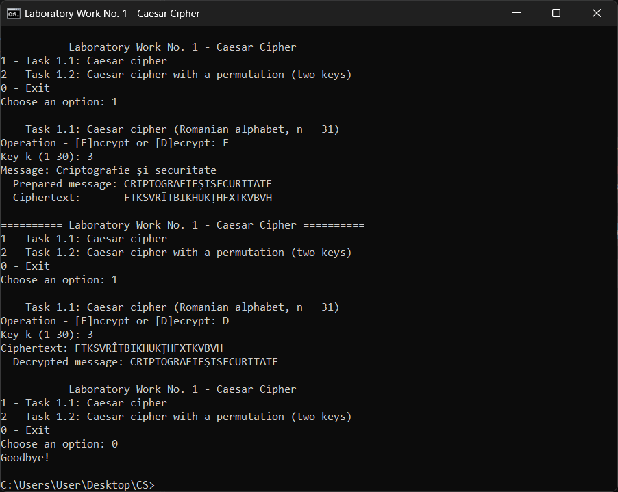
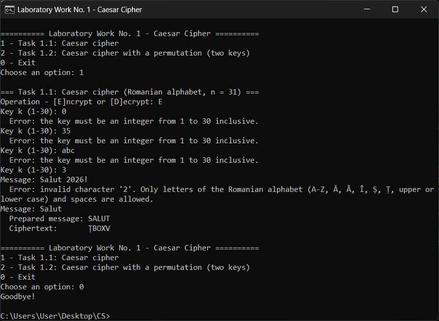
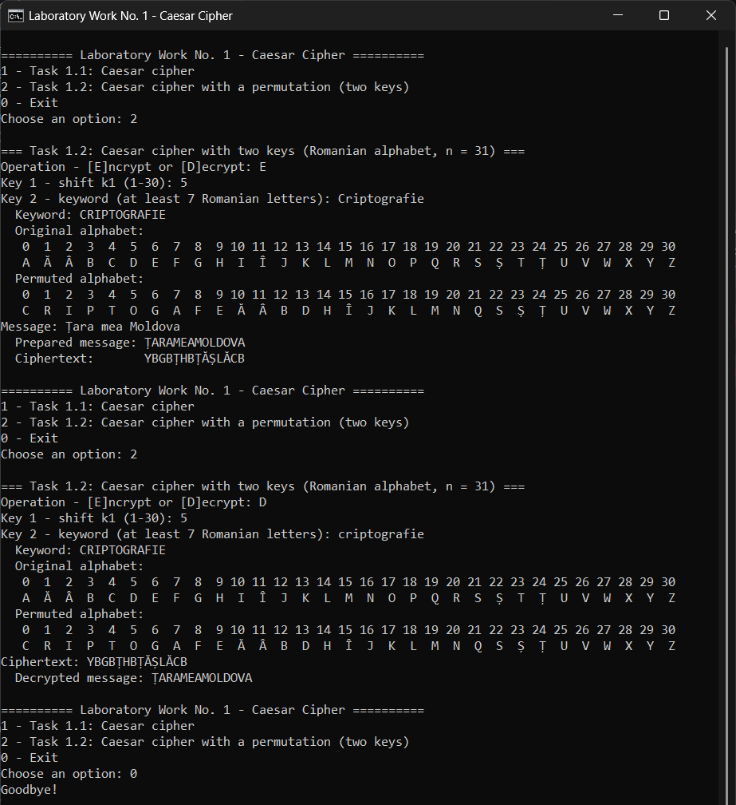
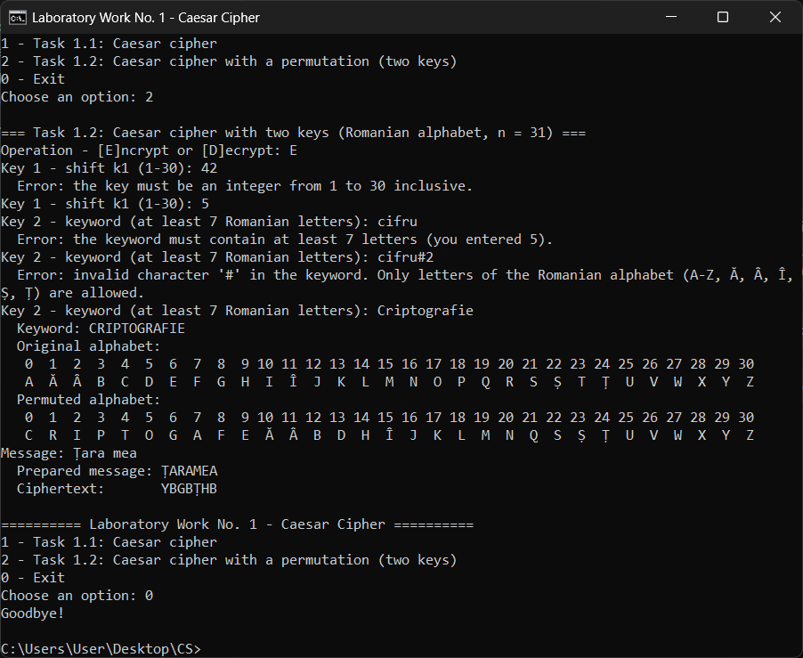

# Laboratory Work No. 1 — Caesar Cipher

**Course:** Cryptography and Security
**Author:** Veaceslav Morari, FAF-243
**Teacher:** Maia Zaica

## Tasks

- **Task 1.1** — Caesar cipher over the Romanian alphabet (n = 31, A = 0 … Z = 30), key from 1 to 30.
- **Task 1.2** — Caesar cipher with two keys: a numeric shift (1–30) and a keyword (at least 7 Romanian letters) that permutes the alphabet.

## Files

| File | Contents |
| --- | --- |
| `caesar_cipher.py` | The program: alphabet encoding, input validation, both ciphers, console menu |
| `test_caesar_cipher.py` | Unit tests |
| `screenshots/` | Screenshots of the running program used in the report |
| `report/Lab1_Report.pdf` | The laboratory report ([PDF](report/Lab1_Report.pdf), LaTeX source in `report/Lab1_Report.tex`) |

## How to run

Requires Python 3.7+.

```
python caesar_cipher.py
python -m unittest -v test_caesar_cipher
```

## Example

| Task | Keys | Message | Ciphertext |
| --- | --- | --- | --- |
| 1.1 | k = 3 | Criptografie și securitate | FTKSVRÎTBIKHUKȚHFXTKVBVH |
| 1.2 | k1 = 5, k2 = CRIPTOGRAFIE | Țara mea Moldova | YBGBȚHBȚĂȘLĂCB |

## Screenshots

**Task 1.1 — encryption and decryption**



**Task 1.1 — invalid key and invalid character**



**Task 1.2 — permuted alphabet, encryption and decryption**



**Task 1.2 — invalid key, short keyword and invalid character**


